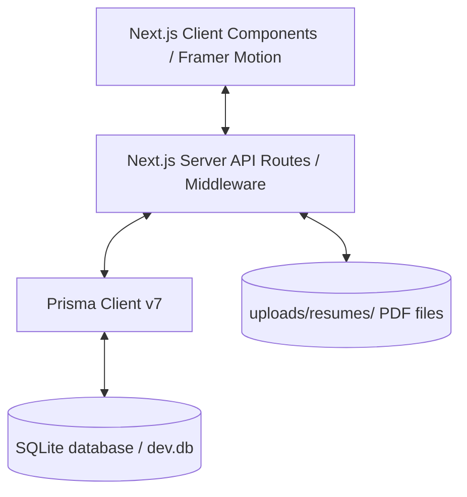

# NexaTech Careers Portal

A production-quality Careers Portal built from scratch for **NexaTech**, a fictional tech company. This application provides a high-fidelity interface for searching jobs, applying with resume uploads, and tracking application status, alongside an administrative workspace to manage openings and review pipeline stages.

---

## Technical Architecture

The project is structured as a unified **Next.js App Router** application, combining server-side rendering, client-side dynamic states, API routes, and a local file-based database:



*   **Framework**: Next.js 14+ (App Router)
*   **Database**: SQLite via Prisma ORM
*   **Styling**: Tailwind CSS
*   **Animations**: Framer Motion
*   **Authentication**: Stateless JWTs stored in `HttpOnly`, `SameSite=Lax` cookies via `jose`
*   **Resumes File Upload**: Safe multipart uploader with file system storage and secure route download streams.

---

## Directory Structure

```text
├── prisma/
│   ├── schema.prisma      # SQLite Database Schema
│   └── seed.ts            # Admin, candidate, and job opening seed data
├── public/                # Static assets (favicons, icons)
├── src/
│   ├── app/
│   │   ├── admin/         # Admin Workspace pages
│   │   ├── api/           # API Endpoints (Auth, Admin, Applications, Notifications)
│   │   ├── dashboard/     # Candidate Dashboard & Notifications Center
│   │   ├── jobs/          # Public Jobs Board & Job Details
│   │   ├── login/         # Sign-in UI
│   │   ├── signup/        # Careers Registration UI
│   │   ├── error.tsx      # Global 500 error boundary
│   │   └── not-found.tsx  # Custom 404 page
│   ├── components/        # Reusable Client & Server components (Navbar, Footer, Filter board)
│   ├── lib/               # Utility functions (Prisma singleton, API wrappers, JWT, PBKDF2 Hashing)
│   └── middleware.ts      # Route protection & role verification (Admin vs. Candidate)
├── uploads/resumes/       # Secure file system storage for candidate resumes
├── package.json
└── tsconfig.json
```

---

## Quick Start Guide

Since NexaTech utilizes SQLite and Next.js Server APIs, running the application on a fresh Windows machine requires only Node.js and Git.

### 1. Clone & Install dependencies
```powershell
git clone <your-repository-url>
cd delightful-carson
npm install
```

### 2. Initialize Database & Seed data
Generate the Prisma Client types, push the schema to SQLite (`dev.db`), and seed initial users and jobs:
```powershell
npx prisma generate
npx prisma db push
npx prisma db seed
```

### 3. Run the Development Server
```powershell
npm run dev
```
Open [http://localhost:3000](http://localhost:3000) in your browser to view the portal.

---

## Seeding Credentials

The seed script establishes two default users:

### 👤 Administrator
*   **Email**: `admin@nexatech.com`
*   **Password**: `AdminPassword123`
*   **Access**: Post/Edit jobs, view all pipeline applicants, update statuses, download resume PDFs.

### 👤 Candidate
*   **Email**: `candidate@example.com`
*   **Password**: `CandidatePassword123`
*   **Access**: Apply to jobs, upload PDF resumes, access Candidate Dashboard, read notifications.

---

## Core Features

1.  **Public Jobs Board**: Multi-select filters for Location, Experience level, and Job Type.
2.  **Auth & Role Access Control**: Middleware protection intercepting unauthorized routes.
3.  **PDF Resume Upload**: Validates uploader size/format and streams files securely.
4.  **Notifications Hub**: In-app center triggering updates on application status changes.
5.  **Admin Review Workspace**: Full search capabilities, timeline decision updates, and custom messaging triggers.
